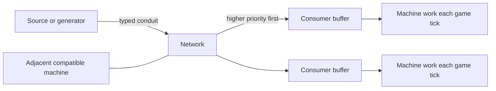

# The Advantage Works Handbook

## First edition: Minecraft 1.10.2

> **Works notice:** This is the operating and commissioning manual for the maintained 1.10.2 editions of Power Advantage, Steam Advantage, and Electric Advantage. Keep it beside the gauge, and distrust any machine that changes its story after a restart.

This handbook serves two audiences at once. A player should be able to build and operate every available machine from it. A maintainer should be able to turn the same instructions into repeatable test worlds and decide whether observed behaviour agrees with DrCyano's original design.

## Books in this set

| Book | Use it for |
| --- | --- |
| [Works Engineer's Guide](works-engineers-guide.md) | Fluids, tanks, conveyors, filters, materials, oils, switches, and optional converters |
| [Steam Engineer's Handbook](steam-engineers-handbook.md) | Boilers, steam distribution, storage, powered plant, drilling, lifting, pumping, and muskets |
| [Electrician's Handbook](electricians-handbook.md) | Generation, wiring, batteries, processing plant, growth chambers, drilling, lighting, and defence |
| [Commissioning and Fault Finding](commissioning-and-fault-finding.md) | Exact test rigs, expected observations, restart checks, and endurance trials |
| [Technical Ledger](technical-ledger.md) | Registry names, rates, capacities, formulae, recipes, NBT, configuration, and source references |
| [Inspector's Register of Possible Legacy Bugs](possible-legacy-bugs.md) | Intent-versus-code discrepancies waiting for gameplay investigation |
| [Advantage Works test rig](../../test-rig/README.md) | Source-controlled generator and runner for the 20 commissioning cards |

## Edition authority

The implementation baseline is deliberately pinned:

| Mod | Maintained 1.10.2 source |
| --- | --- |
| Power Advantage | `582f68d319f8b853618e92989a8bd9505ecfe503` |
| Steam Advantage | `c18253007f9a2976954cafef9654618b11082fe1` |
| Electric Advantage | `0f8bf34ae6c6cf1082fc2beef53bbe0525aeacb4` |

DrCyano's surviving [Power Advantage wiki](http://drcyano.wikidot.com/wiki:power-advantage), [Steam Advantage wiki](http://drcyano.wikidot.com/wiki:steam-advantage), and [Electric Advantage wiki](http://drcyano.wikidot.com/wiki:electric-advantage) are first-class evidence of intended behaviour. Their component pages, update notes, and the three CurseForge galleries are used alongside source comments and maintained code.

| Historical record | Surviving source |
| --- | --- |
| Power component index and changes | [Power wiki](http://drcyano.wikidot.com/wiki:power-advantage), [update log](http://drcyano.wikidot.com/power-advantage-update-log), [CurseForge](https://www.curseforge.com/minecraft/mc-mods/power-advantage) |
| Steam component index and changes | [Steam wiki](http://drcyano.wikidot.com/wiki:steam-advantage), [update log](http://drcyano.wikidot.com/steam-advantage-update-log), [CurseForge](https://www.curseforge.com/minecraft/mc-mods/steam-advantage) |
| Electric component index and changes | [Electric wiki](http://drcyano.wikidot.com/wiki:electric-advantage), [update log](http://drcyano.wikidot.com/electric-advantage-update-log), [CurseForge](https://www.curseforge.com/minecraft/mc-mods/electric-advantage) |

The evidence labels used throughout are literal:

- **Runtime verified**: observed in a maintained 1.10.2 test instance.
- **Code confirmed**: directly established by the pinned implementation.
- **Historical intent**: stated or clearly illustrated by DrCyano's surviving material.
- **Possible legacy bug**: coherent intent and implementation disagree, or the implementation contains a credible defect.
- **Needs verification**: evidence is incomplete, ambiguous, or has not yet had a controlled gameplay test.

Historical intent is not automatically correct. When it is coherent for the machine's purpose, however, it defines the behaviour to test; the manual does not silently rewrite that intent to excuse faulty code.

## Requirements and progression

Power Advantage supplies the common transport and typed-power framework. Steam Advantage and Electric Advantage are extensions and require it. Base Metals remains a distribution requirement for the intended material progression; OreSpawn supplies the expected ore generation chain. The maintained builds avoid hard Base Metals linkage, so absence should not create a Java class-linkage crash, but recipes can still be unavailable when their ore-dictionary materials are absent.

Three recipe modes are selected in the Power Advantage configuration:

| Mode | Workshop character |
| --- | --- |
| `NORMAL` | Easier construction, vanilla-material alternatives, and all essential parts craftable. |
| `TECH_PROGRESSION` | The first key components require the metalworking chain; later duplication is practical. |
| `APOCALYPTIC` | High-value components are intended to be salvaged or found. Some machines lose recipes and recycling recipes are added. |

A practical progression is:

1. Establish iron, copper, steel, brass, and plate/rod production.
2. Build Power Advantage fluid handling and conveyors.
3. Add a water source and one Steam Advantage boiler, pipe, and tank.
4. Commission a steam machine before extending the network.
5. Make silicon, solder, circuits, a power-supply unit, cable, generation, and battery storage.
6. Add advanced electric processing, growth, drilling, and defence only after measuring supply under load.

## The common network law

**Code confirmed:** Steam, electricity, greenhouse power, quantum power, and general fluid are distinct conduit types. Compatible machines can conduct the same type directly from machine to machine; a visible pipe is not required between every pair.

**Code confirmed:** Distribution is recalculated on an eight-game-tick cadence, spatially staggered between blocks. At 20 game ticks per second, one network interval is nominally 0.4 seconds. Machine work can still occur every game tick using its local buffer.

**Code confirmed:** There is no pipe-length pressure or voltage loss in this implementation. A distant machine may starve because generation, request priority, transfer limits, local leakage, or a broken topology is involved, but not because each pipe subtracts pressure with distance.

## Terms used by the works

| Term | Meaning in these manuals |
| --- | --- |
| Conduit | A block joining nodes of one named power or fluid type. |
| Node | A conduit, source, consumer, switch, or compatible machine participating in a network. |
| Local buffer | Energy or steam stored inside a machine between network updates. |
| Pressure | Steam energy shown by a gauge; it is not a simulated gas pressure gradient. |
| Request | A consumer's demand, sorted by priority and then amount. |
| Active | The machine is doing work. This is not always the same as merely containing energy. |
| Terminal pipe | An internal helper that adapts the Power Advantage fluid network to Forge fluid handlers. |
| Rear face | For drills and conveyors, the side opposite the direction of work or travel. |

## Scope and caution

This is a gameplay and QA specification, not Java API documentation. Numeric values are defaults from the pinned source unless labelled otherwise; modpack configuration and ore-dictionary contents can change real recipes. Creative-only and automatically placed helper blocks are listed so world maintainers can identify them, but they are not presented as ordinary equipment.

The historical component-index audit covered every linked player component on the three wiki roots. The Power lightweight-API page is outside this gameplay handbook; wiki help/navigation pages are also excluded. Surviving PCB Printer and Geothermal Generator language labels have no maintained registrations and are identified as unfinished rather than promoted to equipment.

No behaviour was changed while preparing this edition. Findings requiring code work are isolated in the [Inspector's Register](possible-legacy-bugs.md).
