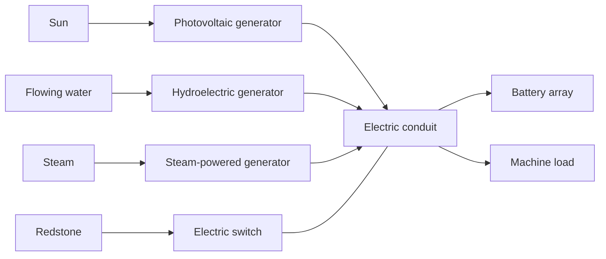
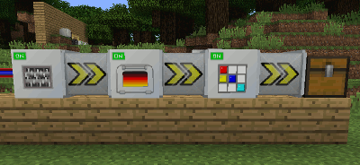
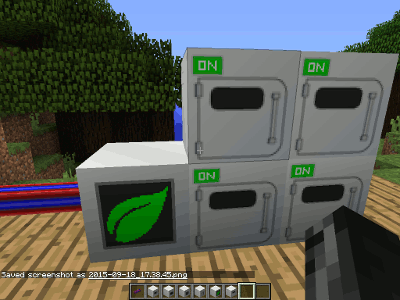

# The Electrician's Handbook

> **Switchboard instruction:** Prove generation, prove storage, then connect the load. A lit cable is not a meter, and an animated machine is not a certificate of supply.

[Handbook index](README.md) | [Technical ledger](technical-ledger.md) | [Commissioning](commissioning-and-fault-finding.md) | [Inspector's register](possible-legacy-bugs.md)

## The electrical works

**Code confirmed:** Electrical blocks use conduit type `electricity`. Electric conduits and adjacent compatible machines form one network. Distribution occurs every eight game ticks; machines spend their local buffers on their own tick schedules. There is no distance voltage drop.

## Conductors, storage, and ores

### Electric conduit

- **Registry:** `electricadvantage:electric_conduit`.
- **Ore names:** `wire`, `conduitElectricity`, `powerCable`, and `cableElectric`.
- **Construction:** Six from plastic or rubber around copper ingots; one from a compact plastic/rubber and copper-rod recipe.
- **Connections:** Joins electrical sources, storage, switches, LEDs, and machine faces. A touching compatible machine can conduct onward.
- **Troubleshooting:** A line crossing another type does not convert power. Use the proper transformer or steam generator.

### Electric switch

`electricadvantage:electric_switch` is the electrical cut-out. **Code confirmed:** no redstone means conducting and a redstone signal means isolated. Treat it as a normally closed contact when drawing control logic.

### Batteries and battery array

| Battery | Capacity | Principal recipe materials |
| --- | ---: | --- |
| Lead-acid | 1,000 | lead, sulfur, water bucket, plastic casing |
| Nickel-hydride | 2,000 | nickel, redstone dust, water bucket, plastic casing |
| Alkaline | 4,000 | iron, gunpowder, zinc, plastic casing |
| Lithium | 8,000 | lithium, redstone dust, carbon dust, plastic casing |

Battery charge persists in item NBT key `energy`. The battery array accepts eight batteries, requests electricity at backup priority, and supplies demands above backup priority. A redstone signal disables output. Inventory and aggregate energy should survive chunk and full-process reloads.

### Native ores and intermediate materials

| Registry item/block | Works use and ore-dictionary names |
| --- | --- |
| `li_ore` | Lithium ore, `oreLithium`; smelts to one lithium ingot and crushes to two lithium powder. |
| `sulfur_ore` | Sulfur ore, `oreSulfur` and `oreSulphur`; drops sulfur material and crushes to four sulfur powder. |
| `li_ingot` / `li_powder` / `li_nugget` | Lithium progression; `ingotLithium`, `dustLithium`, `nuggetLithium`. |
| `sulfur_powder` | `sulfur`, `dustSulfur`, `sulphur`, and `dustSulphur`. |
| `silicon_mix` / `silicon_ingot` | Sand plus carbon dust, then smelting; ingot names `ingotSilicon` and `silicon`. |
| `solder_mix` / `solder` | Two tin dust plus lead or silver dust, then smelting; `solder` and `ingotSolder`. |
| `blank_circuit_board` | Plastic plus copper plate/ingot depending recipe mode. |
| `control_circuit` | Blank board plus microchip and solder; ore name `circuitBoard`. |
| `integrated_circuit` | Silicon/redstone/metal-nugget component; ore name `microchip`. |
| `psu` | Power-supply unit; ore name `PSU`. |
| petrolplastic_ingot | Refinery output; ore names plastic and ingotPlastic. |

ElectricAdvantage always contributes complete editable OreSpawn rules for sulfur and lithium. On fresh profiles its sulfur rule is enabled only when neither Mineralogy nor BaseMinerals is present; its lithium rule is enabled only when BaseMinerals is absent. Existing world/profile choices remain authoritative.

## Generation house

### Photovoltaic generator

- **Purpose:** Generate electricity from skylight.
- **Placement:** Give the top a clear view of the sky. Shadow testing must distinguish blocked sky from weather.
- **Output law:** Source comments target roughly 12,500 energy per Minecraft day. Output follows daylight angle; rain multiplies it by 0.35 and thunder by 0.2. Without sky access, block light contributes only a 0.1 factor.
- **Recipe:** Glass, silicon, wire, and a PSU. It is unavailable as a normal crafting recipe in `APOCALYPTIC` mode.
- **Persistence:** Generation is environmental; saved local energy and GUI state should nevertheless reload coherently.

### Hydroelectric generator

- **Purpose:** Generate from flowing water through a suspended turbine.
- **Placement:** Leave the block immediately below the generator available for its turbine entity and arrange flowing water around that turbine.
- **Rated output:** 4 electricity per game tick when valid; installation is rechecked on a 101-tick schedule.
- **GUI:** ElectricAdvantage `2.2.2.110021` registers the shared generator display and normalizes its active meter to `1.0`; actual generation remains 4 electricity per tick. E-01 automates the server-side output check, while opening and visually checking the meter remains a manual client check for `EA-110-003`.
- **Hazard:** A spinning turbine damages intersecting entities for 5 damage every 8 ticks.
- **Persistence:** The managed hydroturbine stores its parent position and should reconnect or respawn after reload. ElectricAdvantage `2.2.2.110021` also preserves the generator tile while its active blockstate changes; earlier builds could invalidate the turbine's parent after one generation pulse (`EA-110-004`). Do not remove the entity independently.

### Steam-powered electric generator

- **Purpose:** Convert Steam Advantage steam into electricity.
- **Connections/capacities:** Electricity buffer 1,000; steam buffer 32.
- **Conversion:** `31.25` electricity per steam. At the eight-tick network update it can process up to 32 steam, corresponding to 4 steam per game tick. Local steam decay is 0.5 per network update.
- **Placement:** Connect steam and electrical services to any compatible faces, or use direct machine adjacency.
- **Persistence:** Steam and electricity should survive reload.

*Historical gallery image. See [image attribution](assets/ATTRIBUTION.md).*

## Processing machines

The standard electric machine has a 500-unit local electricity buffer unless its class declares another size. Input and output slots are exposed for automation; test sided handling before sealing a production line.

The generic construction frame is `uX /pmp` for one working component or `uXY/pmp` for two: `u=PSU`, `p=plateSteel`, and `m=frameSteel`. All standard faces expose the declared input/output groups through the common machine wrapper; category validation still decides what may enter, and output capacity can stop work.

| Machine and registry | Duty | Rated figures and operating notes |
| --- | --- | --- |
| Arc furnace, `electric_furnace` | Parallel high-temperature smelting | Four inputs, six outputs; 8 electricity/tick; 200 work ticks. Built from bricks around a PSU. |
| Electric crusher, `electric_crusher` | Base Metals crusher/hammer recipes | Three inputs, six outputs; 12 electricity/tick. Crusher result lookup is reflection-compatible across old/new Base Metals. |
| Electric oven, `electric_oven` | Food-only furnace recipes | One input, one output; 4 electricity/tick; 100 work ticks. |
| Automated assembler, `electric_fabricator` | Recursively craft the recipe represented by its reference item | Twelve inputs, two outputs, one reference slot; 16 electricity/tick; 200 progress ticks. Recursion limit defaults to 5. See `EA-110-001` before feeding metal storage blocks. |
| Plastic refinery, `plastic_refinery` | Turn configured oil fluids into petrolplastic | Electricity 500, general fluid 2,000, internal tank 2,000 mB; 12 electricity/tick; 100 ticks and 100 mB per ingot. |
| Electric distiller, `electric_still` | Power Advantage fluid distillation recipes | Electricity 500, general fluid 1,000; 1,000 mB input and output tanks; one recipe unit and 16 electricity per active tick. Default duty is crude oil to refined oil. |

**Controls and GUI:** Redstone generally stops active work through the shared electric-machine logic. The GUI's energy bar is the local buffer, not total network generation. Progress, inventory, tanks, and energy are expected to persist.

## Electric pump

- **Purpose:** Collect world fluid through an automatically extended electric pump pipe.
- **Placement:** Put it above the fluid field with a clear downward shaft.
- **Capacities:** Electricity `9,192` (`1,000 + 256 * 32`), general fluid 1,000, internal fluid tank 1,000 mB.
- **Rated cost:** 100 electricity per pipe section, 32 per vertical lift unit, and 1,000 base cost per pumping operation. Each successful action handles 1,000 mB. Search proceeds in groups of up to 125 positions at 32/11-tick intervals.
- **Automation:** Connect fluid output with spare capacity.
- **Persistence:** Tank, next pump target, extension, and electricity should survive reload.

`electricadvantage:pump_pipe_electric` is an automatically managed shaft helper, not an ordinary pipe for construction.

## Electric drilling department

### Electric drill

- **Registry:** `electricadvantage:electric_drill`.
- **Purpose:** Bore a three-dimensional cutting area forward, collect drops internally, and advance along electric track.
- **Placement/orientation:** All six facings are supported. The drill faces the bore; place an inventory or conveyor at the rear for output and connect electrical service.
- **Range:** 64 blocks.
- **Capacity and cost:** Standard 500-unit buffer; 24 electricity per mining progress tick; 250 per track movement. Mining duration derives from hardness with factor 32.
- **Inventory/output:** Six output slots. Drops go to inventory, not beside the rendered drill beam. Full output prevents further mining.
- **Track:** `electricadvantage:electric_track` combines electric conduit and steel frame and is crafted shapelessly from those blocks.
- **Persistence:** Facing, inventory, electricity, progress, target coordinates, and movement state must survive both horizontal and vertical restart tests.

**Runtime verified:** A maintained fix preserves `UP` and `DOWN` metadata instead of collapsing them to `NORTH`. This remains an acceptance-test item because old saves may contain earlier orientations.

## Controlled agriculture

### Growth-chamber controller

- **Purpose:** Convert electricity, water, and dirt into typed `greenhouse` power.
- **Connections/capacities:** Greenhouse 1,000, electricity 100, general fluid 2,000; water tank 2,000 mB.
- **Conversion:** One greenhouse unit consumes 8 electricity, 2 mB water, and 1 soil unit.
- **Soil:** One accepted `blockDirt` contributes 1,000 soil and the upper bound is 1,500. A second dirt waits in the input while soil is at least 500, then is consumed under load once its full 1,000-unit contribution fits. Runtime characterization closed `EA-110-002` as coherent whole-block refill hysteresis. The GUI provides no numeric soil-capacity display.
- **Layout:** Place any contiguous network of growth chambers against the controller or one another. Historical material says any number may be connected; the typed-network implementation supports a contiguous multi-chamber network.
- **Controls:** Redstone state is sampled; use the commissioning rig to confirm pack-specific control expectations.
- **Persistence:** Water tank, soil, electricity, greenhouse buffer, inventory, and request-age state should survive reload.

### Growth chamber

- **Purpose:** Accelerate or transform seeds, crops, saplings, and other recognised plants.
- **Inventory:** Three input and six output slots.
- **Rated cycle:** One greenhouse energy per active tick for each processed slot; a normal growth stage takes 100 work ticks.
- **Automation:** Feed recognised plant material and extract output. A chamber without controller resources will retain input but make no progress.
- **Persistence:** Inventory, growth classification, per-slot progress, and greenhouse energy should survive reload.

*Historical gallery image. See [image attribution](assets/ATTRIBUTION.md).*

## Lighting and defence

### LED bar

`electricadvantage:led_bar` conducts electricity and emits light while powered. Its local buffer is 0.5 and consumption is 0.125 electricity per game tick at high request priority. Three are made from glass panes, microchips, and wire. Verify light extinction and restoration with the redstone/network interruption card.

### Laser turret

- **Purpose:** Defend an area against monsters and players who are neither the owner nor on the stored team.
- **Supply:** Local buffer 2,000. A shot costs 1,000 electricity and active tracking costs 1 per tick.
- **Engagement:** Target acquisition radius 16; ray reach 32; charge 31 ticks; nominal hit point occurs at charge stage 7; damage 7 and fire duration 3 seconds.
- **Beam:** The historical design and maintained code permit a penetrating line attack rather than a projectile.
- **Controls:** Redstone disables operation. GUI/state records target lock, owner, team, yaw, and pitch.
- **Persistence:** Energy, lock state, owner/team, and orientation must reload. Target entity IDs are session-local and should be reacquired safely.
- **Safety:** Commission against controlled hostile mobs behind a secure barrier. Never use another player as a test target without consent.

`electricadvantage:laser_turret_evil` is a hidden hostile/test variant and is not normal craftable player equipment.

## Recipe modes

- All modes register conductors, circuit-board processing, silicon and solder, batteries, track, machine shells, switch, still, pump, refinery, ore crushing, and lithium smelting.
- `NORMAL` adds simpler integrated circuits, blank boards using copper ingots, PSU recipes using steel or iron, and treats copies of lead/tin/silver ingots as solder-compatible material.
- `TECH_PROGRESSION` makes three integrated circuits from plastic, silicon, redstone, and copper/tin/gold nuggets; its PSU uses wire, a control circuit, and steel plate.
- `APOCALYPTIC` retains a PSU recipe but adds crusher salvage from generators/furnaces/solar equipment down through PSU, control circuit, and integrated circuit. Photovoltaic crafting is otherwise disabled.

The complete registration and pattern catalogue is in the [Technical Ledger](technical-ledger.md#electric-advantage-recipes).

## Unfinished names and managed helpers

Language entries for a PCB Printer and Geothermal Generator survive, but no corresponding player block is registered in this baseline. They are historical or unfinished labels, not available equipment. The hydroturbine entity, pump pipe, hostile turret, and drill track have real registrations but are managed/test/support content as described above.
