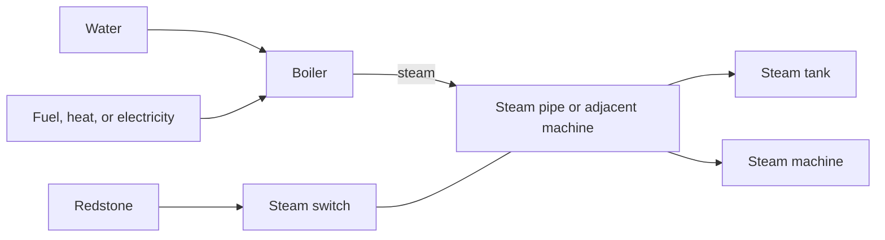
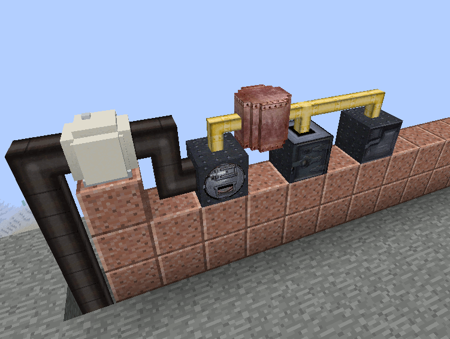
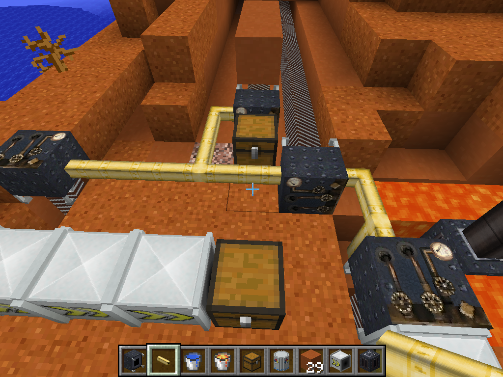
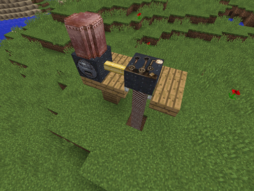

# The Steam Engineer's Handbook

> **Boiler-house rule:** Water first, fire second, load last. A turning flywheel proves motion; it does not prove that the pressure gauge, network cache, or saved state is sound.

[Handbook index](README.md) | [Technical ledger](technical-ledger.md) | [Commissioning](commissioning-and-fault-finding.md) | [Inspector's register](possible-legacy-bugs.md)

## Steam service in one drawing

**Historical intent and code confirmed:** Steam pipes connect producers, stores, and users; two compatible machines touching face-to-face can also conduct steam. Pipes themselves do not impose distance loss.

**Code confirmed:** Most steam plant works from a local steam buffer filled on the eight-tick network cadence. Steam-consuming machines that invoke the shared decay routine lose `0.0625` steam per game tick, nominally `1.25` per second, from that local buffer. This is not a loss per pipe or per block of distance.

## Boilers

### Coal-fired boiler

- **Purpose:** Produce steam from water and any valid furnace fuel.
- **Construction:** Standard steam-machine frame with a steam conduit as the working component.
- **Connections:** Steam and general-fluid services can connect through compatible faces. Its water tank holds 4,000 mB; the local steam/general network capacities are 1,000 units each.
- **Operation:** Insert solid fuel and provide water. The fluid interface accepts water and, by implementation, lava; lava may be requested in 100 mB portions and contributes 16 burn ticks per mB.
- **GUI:** Water, fuel burn, and steam/gauge readings are the commissioning indicators. A low gauge can be correct if the connected plant consumes output as fast as it is made.
- **Automation:** Fuel inventory and fluid handling are available to hoppers/conveyors/pipes subject to face rules.
- **Persistence:** Water, inventory, `BurnTime`, `BurnTimeTotal`, and steam buffer should survive reload.
- **Troubleshooting:** Isolate the boiler from consumers. If pressure rises alone, the problem is supply-to-load balance rather than ignition.

### Electric boiler

- **Purpose:** Convert Electric Advantage electricity and water to steam.
- **Connections/capacities:** Steam 100, electricity 160, general fluid 1,000; water tank 2,000 mB.
- **Rated operation:** Consumes 16 electricity per game tick to make 0.5 steam per game tick, a direct ratio of 32 electricity per steam.
- **Controls:** Redstone inhibits ordinary machine operation where the shared boiler logic checks it. Verify the actual state before enclosing controls.
- **Persistence:** Water, electricity, steam, and machine state should survive reload.
- **Troubleshooting:** Confirm Electric Advantage is loaded, electricity reaches the boiler, and water is actually in its internal tank.

### Geothermal boiler

- **Purpose:** Use adjacent heat, especially lava or fire, to boil water without a carried fuel item.
- **Connections/capacities:** Steam 100, general fluid 1,000; water tank 2,000 mB.
- **Rated figures:** Maximum temperature 2,000. Fire contributes a 200-degree heat target; an adjacent fluid contributes `(fluid temperature - 372) * 0.5`. Steam production is `0.001 * temperature` per game tick, and each steam unit removes 24 temperature units in the heat model.
- **Placement:** Put the boiler beside the heat source, not merely near it. Protect combustible surroundings.
- **Persistence:** Water, steam, and temperature should survive a full restart.
- **Inspector's repair note:** SteamAdvantage `2.2.2.110021` reads canonical `Temperature` with a `Tempoerature` fallback and continues to write the canonical key. S-01 verifies the hot state through a full process restart; see `SA-110-002`.

### Oil-fired boiler

- **Purpose:** Burn configured liquid fuel and water to produce steam.
- **Connections/capacities:** Steam and general-fluid buffers 1,000 each; separate water and fuel tanks of 4,000 mB each.
- **Operation:** Fuel is processed in 100 mB portions. Default configured values are `oil=5000` and `fuel=25000`; accepted names and burn values are configuration data, not visual fluid names.
- **Persistence:** `WaterTank`, `FuelTank`, `BurnTime`, `BurnTimeTotal`, and steam should survive reload.
- **Troubleshooting:** Inspect the registry name reported by the fluid and the `fluid_fuel_values` setting. "Oil" supplied under another name will not match by appearance alone.

*Historical gallery image. See [image attribution](assets/ATTRIBUTION.md).*

## Distribution, storage, and control

| Component | Operating instruction |
| --- | --- |
| Steam pipe, `steamadvantage:steam_pipe` | Brass conduit carrying type `steam`. Six are crafted at once. It has no per-block pressure drop. |
| Steam tank, `steamadvantage:steam_tank` | Stores 10,000 steam. It requests at backup priority and supplies consumers above backup priority. A redstone signal disables output. Local steam decay applies. |
| Steam switch, `steamadvantage:steam_switch` | A network cut-out. No redstone means conducting; redstone means isolated. |
| Steam track, `steamadvantage:steam_track` | Combined steam pipe and steel frame that lets a steam drill advance while retaining service. Craft shapelessly from one steam pipe and one steel frame. |

### Reading pressure correctly

The gauge is a view of the selected machine's local steam buffer, not a measurement propagated continuously along a pipe. A spinning drill with a zero gauge can therefore indicate stale client synchronization, an eight-tick refill boundary, or energy that has already been consumed. Test the machine in isolation, reopen the GUI, and compare work performed before declaring network failure.

**Runtime verified:** Maintained 1.10 testing has exercised branched horizontal drill networks and restart behaviour. The layout below is a current test installation, not DrCyano-era artwork.

*Current field-test image. See [image attribution](assets/ATTRIBUTION.md).*

## Processing plant

### Steam blast furnace

- **Purpose:** Smelt three input stacks in parallel.
- **Construction:** Standard machine pattern with a furnace.
- **Inventory:** Seven slots: one solid-fuel slot, three inputs, and three corresponding outputs.
- **Rated figures:** Steam buffer 200. Solid fuel supplies heat at 2.5 temperature units per active tick without steam and 15 with steam. Minimum smelting temperature is 100, maximum 2,000. Progress advances by `0.0000035 * temperature` per active tick and steam use is 0.5 per active tick.
- **Important:** Steam accelerates and heats the furnace; it does not replace solid fuel.
- **Automation:** Feed the input group and remove the output group. Test sided inventory behaviour before building a concealed line.
- **Persistence:** Inventory, energy, temperature, burn/progress data should survive reload.

### Steam rock crusher

- **Purpose:** Apply Base Metals Crack Hammer/crusher recipes automatically.
- **Construction:** Standard two-component machine with a piston and steel block.
- **Inventory:** One input and five output slots.
- **Rated figures:** Steam buffer 50; 1.5 steam per progress tick; 125 progress ticks per operation.
- **Recipe behaviour:** Uses the reflection-compatible Base Metals crusher registry when available and falls back where maintained code provides a vanilla result.
- **Automation:** Hopper/conveyor input and output are expected. A full output bank halts work rather than discarding produce.
- **Persistence:** Input, outputs, progress, and steam should survive reload.
- **Comparator:** SteamAdvantage `2.2.2.110021` restores vanilla-style proportional output from empty `0` to full `15`. S-04 holds the one-item regression witness; see `SA-110-003`.

### Steam distiller

- **Purpose:** Perform Power Advantage distillation recipes without solid fuel.
- **Construction:** Standard two-component machine with two buckets.
- **Connections/capacities:** Steam 100, general fluid 1,000; input and output tanks are 1,000 mB each.
- **Operation:** Supply steam and a fluid matching the common distillation registry. Default duty is crude oil to refined oil at 2:1.
- **Rated figures:** The still applies two recipe units per active game tick and consumes 1.5 steam on each active tick, in addition to normal local steam decay.
- **Persistence:** `TankIn`, `TankOut`, steam, and progress should survive reload.

## Drilling department

### Steam drill

**Historical intent:** The drill bores up to 64 blocks in its facing direction, collects broken-block output internally, and can move into a correctly aligned steam track when it reaches its travel condition. The old position becomes pipework and the bore receives the drill's extension/frame pieces. A conveyor or inventory at the rear can collect output.

- **Construction:** Standard machine with a steam drill bit. `NORMAL` mode also offers a diamond-pickaxe alternative. The drill bit itself uses a sprocket, steel, and diamonds.
- **Placement/orientation:** The facing is the drilling direction. All six facings are valid. Rotate before commissioning and leave the rear face accessible for steam and output handling.
- **Range:** 64 blocks from the drill body.
- **Rated figures:** Steam buffer 50; 2.5 steam to extend the bit, 1 steam per mining progress tick, and 10 steam to move along track. Mining duration depends on block hardness with factor 32.
- **Output:** Broken-block drops enter six internal output slots and may pass to a rear inventory/conveyor. Nothing should be expected to spill beside the visible bit during normal successful operation.
- **Track movement:** Preserve clear space and align track with the drill. Movement must retain facing, inventory, steam, and target state.
- **Safety:** The drill-bit block damages entities. Do not stand in the bore.
- **Persistence:** Facing, inventory, steam, progress, target coordinates, and movement state should survive same-session and full-process reloads.

*Historical gallery image. See [image attribution](assets/ATTRIBUTION.md).*

> **Commissioner's note:** Earlier maintained testing found horizontal-facing and movement restoration faults and repaired them. This manual still requires vertical and horizontal restart trials because those paths have historically failed differently.

## Pumping and lifting

### Steam pump

- **Purpose:** Find and collect world fluid through an automatically extended pump pipe.
- **Placement:** Put the pump above the target fluid and keep the downward shaft clear.
- **Capacities:** Steam 300, general fluid 1,000, internal fluid tank 1,000 mB.
- **Rated cost:** 5 steam per pump-pipe section, 1 per vertical lift unit, and a base 32 per pumping operation. Search proceeds in batches of up to 125 blocks with normal/fast intervals of 32/11 ticks.
- **Automation:** Connect the output fluid network and ensure it has capacity before expecting continued collection.
- **Persistence:** Tank, next pump target, extension, and steam should survive reload.
- **Inspector's repair note:** SteamAdvantage `2.2.2.110021` reads canonical `Tank` with a `TankOut` fallback and continues to write `Tank`. S-06 verifies an isolated 1,000 mB load through a full process restart; see `SA-110-001`.

`steamadvantage:pump_pipe_steam` is an automatically managed helper shaft, not ordinary player plant.

### Steam elevator

- **Purpose:** Raise or lower a platform within a clear vertical shaft.
- **Construction:** Standard two-component machine with piston and sprocket.
- **Rated figures:** Steam buffer 64, cost 32 steam per movement, maximum travel 16 blocks.
- **Placement:** Build a clear shaft above the controller. The platform stops two blocks below the obstruction/ceiling so the passenger has headroom.
- **Controls:** GUI selects direction and redstone triggers movement according to the stored `up` state.
- **Persistence:** Direction, steam, and platform state should survive reload.

`steamadvantage:platform` is the elevator's managed platform helper.

## The works musket

The optional musket is survival equipment, not part of the steam network.

| Item/enchantment | Behaviour |
| --- | --- |
| Steam governor, `steam_governor` | Brass control component and machine ingredient; ore names `governor` and `governorBrass`. |
| Black-powder cartridge, `blackpowder_cartridge` | Lead nugget, gunpowder, and paper; ore name `ammoBlackpowder`. |
| Musket, `musket` | Steel-and-wood firearm, default range 64 and configured base shot damage 20. Repair with steel ingots. Loading state persists on the item. |
| `rapid_reload` | Level I, rare; reloads immediately when ammunition is available. |
| `powderless` | Level I, very rare; permits firing/reloading without consuming a cartridge. |
| `high_explosive` | Levels I-V, uncommon; adds an explosion of `0.75 * level` and ignites nearby living entities for `level` seconds. |
| `recoil` | Levels I-V, common; kicks the shooter backwards with strength proportional to level. |

**Historical intent:** Hold use to load, then fire a loaded musket. Maintained code records unloaded/loading/loaded state in item NBT. The exact two-stage interaction should be included in manual gameplay testing because the implementation uses both use-completion and release events.

## Steam recipe modes

- `NORMAL`: governor uses iron nugget, sticks, and brass; the musket is craftable when enabled; a diamond-pickaxe drill recipe is added.
- `TECH_PROGRESSION`: governor uses sprocket, rods, and brass; the musket remains craftable when enabled.
- `APOCALYPTIC`: governor remains craftable from advanced parts, but the musket has no recipe; crusher salvage returns governors from major steam machines and sprockets from governors.
- All modes: drill bit, brass pipes, principal machines, tank, cartridge, track, switch, oil boiler, pump, and still recipes register. Exact patterns are in the [Technical Ledger](technical-ledger.md#steam-advantage-recipes).
