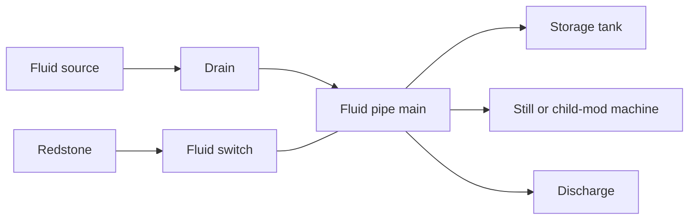
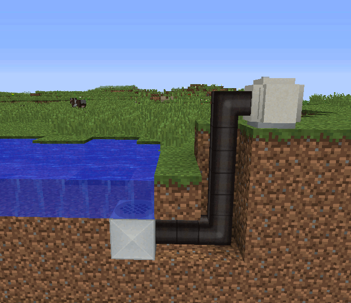
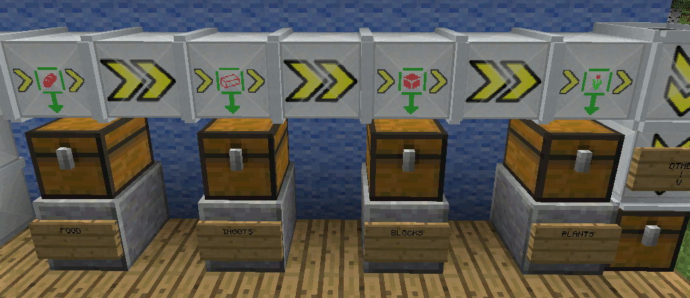

# The Works Engineer's Guide

> **Foreman's instruction:** Establish sound transport before blaming the boiler, dynamo, or machine. A works with no dependable way to move water, oil, and output is merely an expensive arrangement of blocks.

[Handbook index](README.md) | [Technical ledger](technical-ledger.md) | [Commissioning](commissioning-and-fault-finding.md) | [Inspector's register](possible-legacy-bugs.md)

## Works notice: shared services

Power Advantage is the common works layer. It provides fluid handling, item conveyors, fabrication materials, creative test sources, and optional power converters. Steam and Electric Advantage use its conduit API and many of its ore-dictionary parts.

**Code confirmed:** General-fluid networks distribute on the common eight-tick network cadence. The fluid itself determines compatibility, and an external Forge fluid handler next to a fluid pipe is joined through an automatically managed terminal helper.



## Fluid department

### Fluid drain

**Purpose:** Collect world fluid source blocks or withdraw from an adjacent Forge fluid handler.

- **Construction:** bars over a steel-frame and pipe base, with two steel plates at the sides. Exact pattern is in the [recipe ledger](technical-ledger.md#power-advantage-recipes).
- **Placement and connections:** Put the collecting face beneath a source block. Any of the six adjacent faces can exchange with a compatible fluid handler. Connect a fluid pipe to carry the output away.
- **Input/output:** Finds a source above, then searches upward and horizontally through the same fluid for up to 32 steps. A collected world source is removed. Its network buffer is 1,000 mB.
- **Controls and GUI:** The GUI reports the internal fluid. There is no item filter or redstone setting on the drain itself.
- **Automation:** Pipe output is native; adjacent Forge tanks can also be drained.
- **Persistence:** The buffered fluid is expected to survive chunk unload and full restart.
- **Troubleshooting:** Confirm the block is a source, not merely flowing fluid; confirm the outgoing network has somewhere to accept it; inspect the fluid switch state.

**Historical intent:** DrCyano's page illustrates a drain beneath water feeding a pipe network. Update notes broaden that account to adjacent fluid handlers, which agrees with the maintained code.



*Historical gallery image. See [image attribution](assets/ATTRIBUTION.md).*

### Fluid discharge

**Purpose:** Return piped fluid to the world or place it in an adjacent handler.

- **Construction:** The drain pattern inverted: pipes across the top, steel-frame and plates in the middle, bars below.
- **Placement and connections:** Connect the general-fluid main and leave a valid destination below.
- **Input/output:** Holds 1,000 mB. It first services a compatible handler; for placeable fluids it searches downward and horizontally for a destination, up to 32 steps.
- **Controls:** No integral redstone control; fit a fluid switch in the line.
- **Hazards:** Discharging lava, oil, or refined oil is a real world placement operation. Provide containment.
- **Persistence:** Buffered fluid is expected to persist.
- **Troubleshooting:** A fluid may have no placeable block, the space may be obstructed, or the receiver may reject that fluid.

### Portable fluid storage tank

**Purpose:** A 4,000 mB portable tank for transport and modest buffering.

- **Construction:** Plastic ingots around a fluid pipe.
- **Connections:** All faces participate in the fluid network and Forge fluid handling.
- **Controls and GUI:** The GUI shows fluid type and quantity.
- **Persistence:** **Code confirmed:** Tank contents are written into the dropped item when broken and restored when placed. Contents should also survive save/reload.
- **Troubleshooting:** If the tank appears empty after a complete client restart, do not break it immediately; record the NBT/reload defect using the fluid persistence test card.

### Metal fluid storage tank

**Purpose:** A 10,000 mB fixed works tank.

- **Construction:** Steel ingots around a pipe; `NORMAL` mode also accepts iron ingots.
- **Connections:** All faces can join the fluid network.
- **Controls and GUI:** A filled fluid container in its filter slot selects the accepted fluid. The filter item is a pattern and is not consumed.
- **Persistence:** Placed contents should survive saves. **Code confirmed:** Unlike the portable tank, breaking it does not preserve the contents in the dropped block item.
- **Troubleshooting:** A filtered tank will refuse a different fluid; remove or replace the filter deliberately.

### Distillation furnace

**Purpose:** Burn solid fuel to transform a configured input fluid into an output fluid.

- **Construction:** Two buckets and a pipe over a furnace.
- **Connections:** Input and output tanks are each 1,000 mB. Use separate pipe arrangements or containers so output cannot return to an incompatible input.
- **Operation:** The default recipe is `2*crude_oil -> 1*refined_oil`; configuration may replace or extend the list. Work advances at one recipe unit per game tick while fuel and valid fluid are present.
- **Controls and GUI:** GUI shows both tanks, burn state, and progress. Solid fuel is inserted in the fuel slot.
- **Automation:** Fluid faces expose tank handling; solid-fuel insertion and container handling should be checked against the intended face in the test rig.
- **Persistence:** Input, output, burn time, inventory, and progress are expected to survive reload.
- **Troubleshooting:** A startup warning that a named fluid is absent means its distillation recipe cannot register. Check exact fluid registry names and load order.

### Fluid pipe, terminal, and switch

| Component | Shop-floor instruction |
| --- | --- |
| Fluid pipe, `poweradvantage:fluid_pipe` | Carries the general-fluid conduit type. It can transport any registered fluid but a connected network must not be assumed to mix unlike fluids safely. |
| Fluid pipe terminal, `poweradvantage:fluid_pipe_terminal` | **Hidden helper:** automatically adapts a pipe connection to external Forge fluid handlers. Do not treat it as ordinary player equipment. |
| Fluid switch, `poweradvantage:fluid_switch` | Lever-pattern conduit switch. **Code confirmed:** no redstone signal means connected; a redstone signal opens the network and stops conduction. |

> **Electrician's note:** The switch logic is fail-open in the electrical sense but visually easy to misread: powered redstone disables throughput. Test both states before enclosing it in a wall.

## Materials and workshop tools

| Item/block | Purpose and integration |
| --- | --- |
| Starch, `poweradvantage:starch` | Crusher output from ordinary or poisonous potatoes; smelt one to one into bioplastic. Ore name `starch`. |
| Bioplastic ingot, `poweradvantage:bioplastic_ingot` | Tank and electrical insulation material. Ore names `plastic` and `ingotPlastic`; optionally also rubber names when configured. |
| Sprocket, `poweradvantage:sprocket` | Common mechanical ingredient. Ore names `sprocket`, `gear`, `sprocketSteel`, and `gearSteel`. |
| Rotation tool, `poweradvantage:rotator_tool` | Right-click orientable works blocks to cycle their facing. Recheck connections after rotation. |
| Steel frame, `poweradvantage:steel_frame` | Structural machine ingredient and drill-track component. Ore name `frameSteel`. |
| Crude oil, registry fluid `crude_oil` | Distillation feed and configurable liquid fuel. Contact applies Slowness III for 10 seconds. Default furnace value 5 ticks/mB, or 5,000 ticks per bucket. |
| Refined oil, registry fluid `refined_oil` | Distillation product and better liquid fuel. Default furnace value 25 ticks/mB, or 25,000 ticks per bucket. Original and maintained 1.10 code apply Nausea for 10 seconds on contact. |

**Historical note:** The wiki describes refined-oil contact as poisoning, but the original `2.3.0` release applies Minecraft's Nausea effect. Treat "poisoning" as descriptive wording, not a requirement for the specific Poison effect; inspector finding `PA-110-001` is closed.

## Conveyor department

### Ordinary conveyor

**Purpose:** Move loose items and transfer items between inventories.

- **Construction:** Five conveyors from steel plate, sprockets, and a hopper.
- **Placement and orientation:** The arrow is the travel direction. The conveyor extracts from the inventory behind and inserts into the inventory in front. It can carry entities and items up slopes.
- **Controls:** Use the rotation tool to set direction. There is no power requirement.
- **Automation:** Inventory extraction/insertion is built in. A chest or machine at the receiving face must accept the item.
- **Persistence:** Conveyors contain no working stock that should become long-term storage; downstream inventories own accepted items.
- **Troubleshooting:** Verify the arrow, inventory sidedness, and destination capacity. Items on top and items inside an upstream inventory are distinct paths.



*Historical gallery image. See [image attribution](assets/ATTRIBUTION.md).*

### Conveyor filters

Every filter is built vertically from a conveyor, its sample ingredient, and a wooden pressure plate. A matching item is routed downward into an inventory if possible, otherwise toward the space below. Non-matching items continue forward. The overflow filter first tries downward and only passes forward when the downward destination cannot accept the item.

| Registry block | Matching rule | Sample ingredient |
| --- | --- | --- |
| `item_filter_block` | Placeable blocks | `stone` |
| `item_filter_food` | Edible items | `bread` |
| `item_filter_fuel` | Furnace fuels, including registered coal/carbon dust fuels | `coal` |
| `item_filter_inventory` | Items representing inventory-bearing blocks | `chest` |
| `item_filter_ore` | Ore/ingot material classification | `ingotGold` |
| `item_filter_plant` | Plant and growing material classification | `treeSapling` |
| `item_filter_smelt` | Items with a furnace-smelting result | `furnace` |
| `item_filter_overflow` | Any item that the lower destination can accept | No sample ingredient |

**Commissioning card:** Feed one matching and one non-matching stack. The matching stack must go down and the other forward. Fill the lower chest and repeat: an overflow filter must pass the item forward; category filters should be observed and recorded rather than assumed to share overflow semantics.

## Optional power converters

Converters appear only when their integration is enabled and the corresponding API/mod is available.

| Registry block | Conversion service | Recipe key |
| --- | --- | --- |
| `poweradvantage:converter_rf_steam` | Redstone Flux and Steam Advantage steam | governor + steel frame + redstone block |
| `poweradvantage:converter_rf_electricity` | Redstone Flux and Electric Advantage electricity | PSU + steel frame + redstone block |
| `poweradvantage:converter_rf_quantum` | Redstone Flux and quantum conduit power | ender pearl + steel frame + redstone block |
| `poweradvantage:converter_tr_electricity` | Tech Reborn electricity and Electric Advantage electricity | PSU surrounded by refined-iron ingots |

**Code confirmed:** Default RF ratios in configuration are `steam=8`, `electricity=0.25`, and `quantum=8`; Tech Reborn electricity defaults to `0.25`. Establish direction and displayed units with the converter test rig before using these ratios for balance calculations.

## Test sources and non-production blocks

`poweradvantage:infinite_steam`, `poweradvantage:infinite_electricity`, and `poweradvantage:infinite_quantum` are creative testing sources. They are excellent commissioning instruments and unsuitable evidence of survival-generation balance. Keep them out of production-world examples unless the caption says "test supply."

## A compact works layout

```text
Plan view

 [water]                  [solid fuel]
    D====fluid switch====[still]====[metal tank]
                              |
                         refined oil main

 [input chest] -> conveyor -> filter -> [machine]
                                 |
                           [sorted chest]

 D = fluid drain, ==== = fluid pipe, -> = conveyor direction
```

Commission the water/oil and item systems independently. Save, quit to title, reload, then close Minecraft completely and repeat. A works that only survives the first kind of reload has not passed acceptance.
